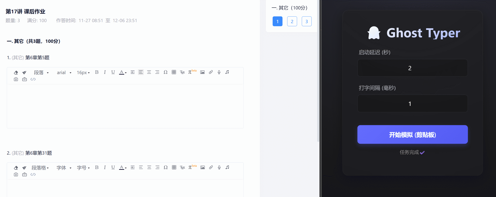

  
  <h1>👻 Ghost Typer</h1>
  

    <strong>一个基于 Tauri v2 + Rust 的隐形自动打字工具</strong>
  

  

    模拟物理击键 | 绕过粘贴限制 | 跨平台支持
  

  
  
  
  
  

 

## 📖 简介 (Introduction)

**Ghost Typer** 是一个利用剪贴板内容的自动打字工具。与普通的“粘贴”操作不同，它利用底层驱动**模拟真实的物理键盘按键事件** (Key Press)，逐字输入内容。

这使得它在以下场景中格外有用：
* 🚫 **受限输入框**：某些网站或软件禁止使用 `Ctrl+V` 粘贴。
* 🖥️ **远程环境**：在远程桌面 (RDP)、TeamViewer 或虚拟机 (VM) 中，剪贴板共享经常失效或粘贴乱码。
* 🤖 **自动化测试**：需要模拟真实用户输入速度的场景。

## ✨ 核心特性 (Features)

* 🚀 **极速启动**：基于 Rust 后端，由 Tauri v2 驱动，内存占用极低，启动瞬间完成。
* ⌨️ **真实模拟**：使用 `enigo` 库模拟底层键盘敲击，非系统级粘贴，更难被检测。
* ⚡ **全局热键**：支持 `Ctrl + Alt + V` 一键启动，无需频繁切换窗口。
* 🎨 **现代化 UI**：提供清晰的倒计时动画与状态反馈 (基于 TypeScript + Vite)。
* 💾 **配置持久化**：自动记忆你的延迟设置，下次打开即用。

## 📸 演示 (Demo)

## 🛠️ 技术栈 (Tech Stack)

* **Core Framework**: [Tauri v2](https://v2.tauri.app/)
* **Backend**: Rust (利用 `enigo` 进行键鼠模拟)
* **Frontend**: TypeScript, HTML/CSS, Vite
* **State Management**: `tauri-plugin-store` (本地 JSON 持久化)

## 📦 安装与运行 (Installation)

### 前置要求
请确保:
- 你已安装 [Rust](https://www.rust-lang.org/tools/install) 和 [Node.js](https://nodejs.org/)。
- 你不知道可以，或者懒得每次 F12 或 ctrl+shift+i 来费劲粘贴。

### 安装
点我 [下载](https://github.com/2bitbit/ghost-typer/releases/latest)

## 🎮 使用说明 (Usage)
1. 复制文本：先在任意地方复制你想要输入的文本到剪贴板。

2. 设置延迟：
   - 启动延迟：点击开始后等待几秒再打字（给你切换窗口的时间）。
   - 输入间隔：每个字符之间的停顿毫秒数（太快可能导致远程桌面丢包）。
  
3. 启动任务：
   - 🖱️ 方式一：点击界面上的“开始模拟”按钮，然后迅速切换到目标输入框。
   - ⌨️ 方式二 (推荐)：直接切换到目标输入框，按下 `Ctrl + Alt + V`，立刻开始自动打字。

## 🤝 贡献 (Contributing)
非常欢迎提交 Issue 和 Pull Request！ 如果你发现某些软件无法模拟输入，或者有更好的 UI 建议，请随时告诉我们。

## 📄 许可证 (License)
本项目基于 MIT 许可证开源。